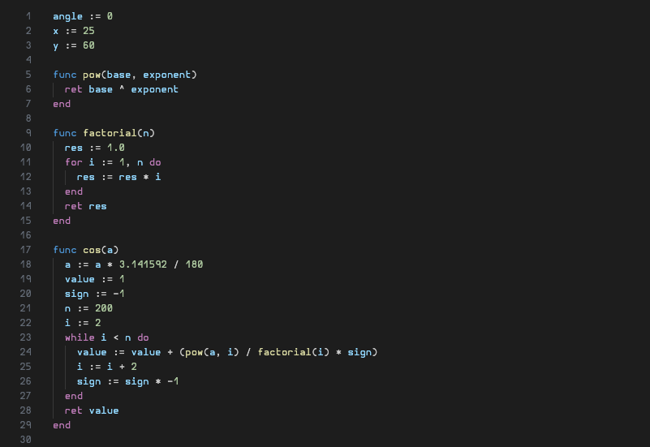

# vscode-pinky

A syntax highlighter for the Pinky scripting language.

[https://pinky-lang.org/](https://pinky-lang.org/)

## Installation

1. Open the Extensions view (Ctrl+Shift+X).
2. Search for "vscode-pinky".
3. Click "Install".

## Screenshot

