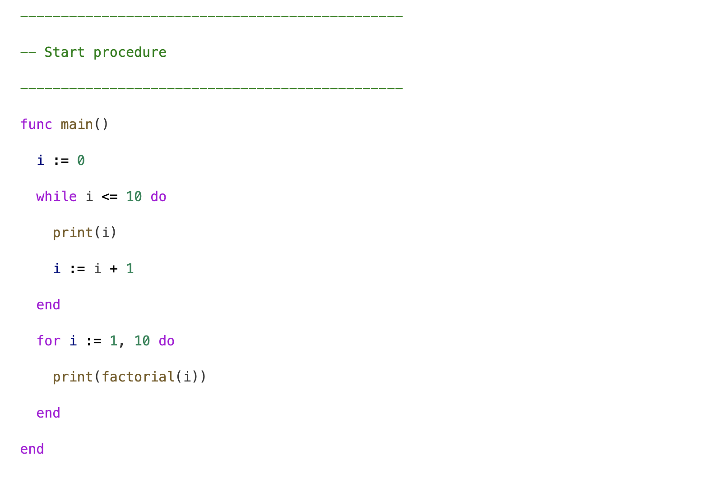
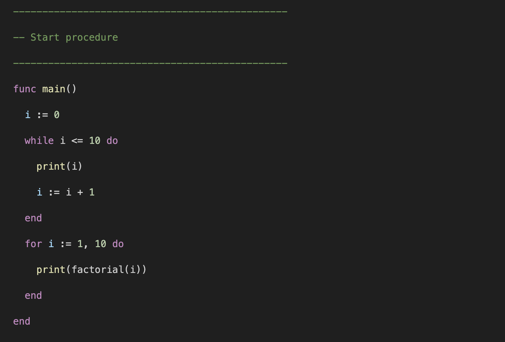
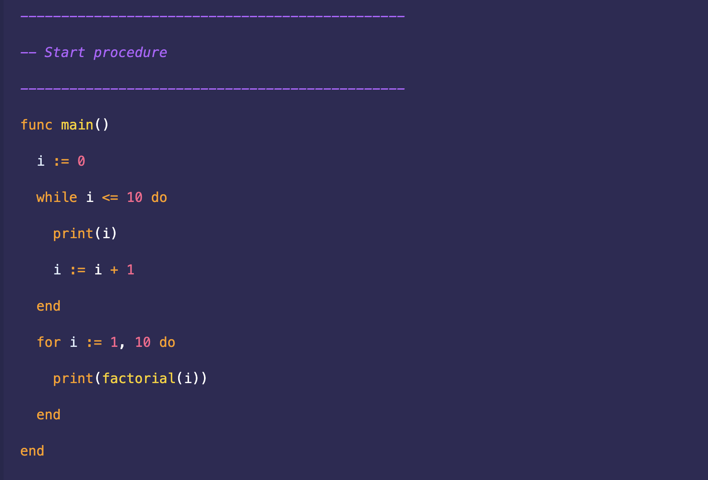

# vscode-pinky

A syntax highlighter for the Pinky programming language.

## Installation

1. Open the Extensions view (Ctrl+Shift+X).
2. Search for "vscode-pinky".
3. Click "Install".

## Screenshots

_Light Modern_

_Monokai_

_Shades of Purple_
